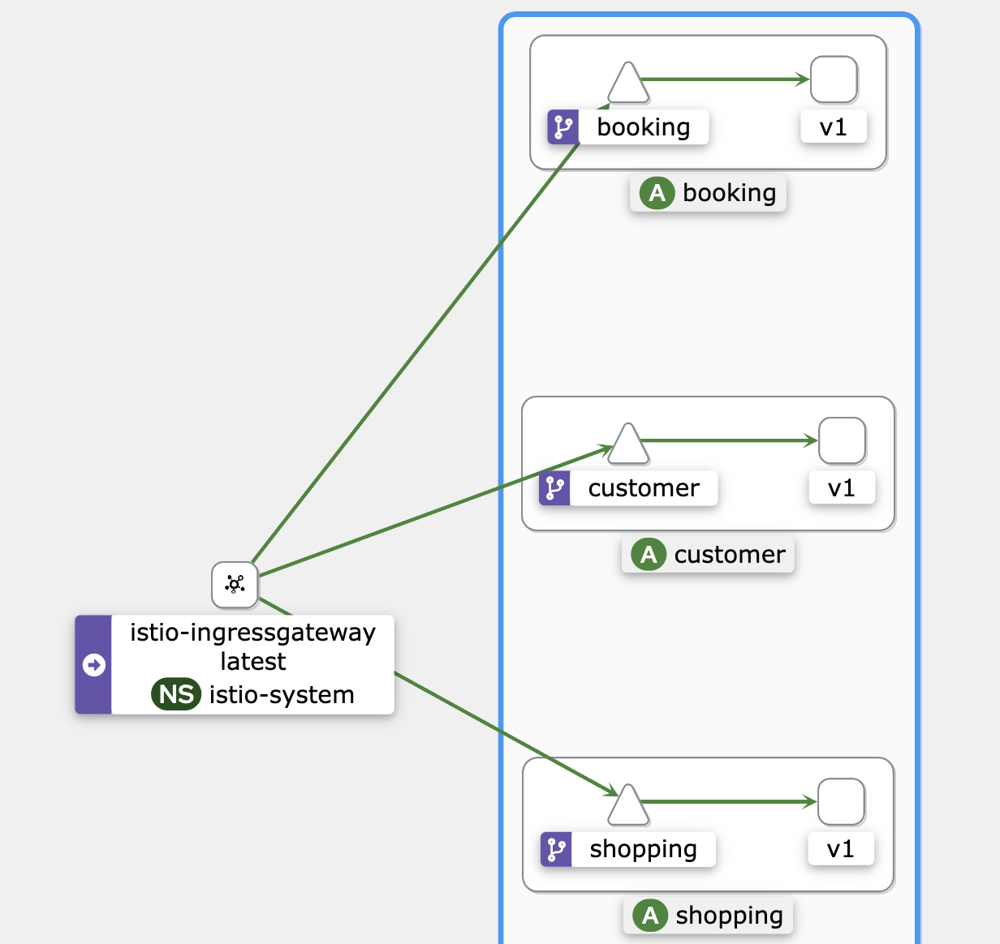

# istiosample-application
> Spring boot 애플리케이션을 배포하고 Istio를 이용해 쿠버네티스 서비스 매쉬를 구성

## 애플리케이션 컨테이너 생성
```bash
./gradlew jib
```

## 쿠버네티스 오브젝트 생성
```bash
kubectl apply -f user-service.yaml
kubectl apply -f shopping-service.yaml
kubectl apply -f booking-service.yaml

kubectl apply -f gateway.yaml
istioctl analyze
```

## 인바운드 설정
### Minikube인 경우
```bash
minikube tunnel

export INGRESS_HOST=$(kubectl -n istio-system get service istio-ingressgateway -o jsonpath='{.status.loadBalancer.ingress[0].ip}')
export INGRESS_PORT=$(kubectl -n istio-system get service istio-ingressgateway -o jsonpath='{.spec.ports[?(@.name=="http2")].port}')
export SECURE_INGRESS_PORT=$(kubectl -n istio-system get service istio-ingressgateway -o jsonpath='{.spec.ports[?(@.name=="https")].port}')
export GATEWAY_URL=$INGRESS_HOST:$INGRESS_PORT

echo "$GATEWAY_URL"
127.0.0.1:80
```

## 서비스 매쉬 가시화
> kiali를 설치한 상태에서만 가능
```bash
watch -n 1 curl -o /dev/null -s -w %{http_code} $GATEWAY_URL/api/v1/users # users API 요청
watch -n 1 curl -o /dev/null -s -w %{http_code} $GATEWAY_URL/api/v1/booking # booking API 요청
watch -n 1 curl -o /dev/null -s -w %{http_code} $GATEWAY_URL/api/v1/shopping # shopping API 요청

istioctl dashboard kiali
```


